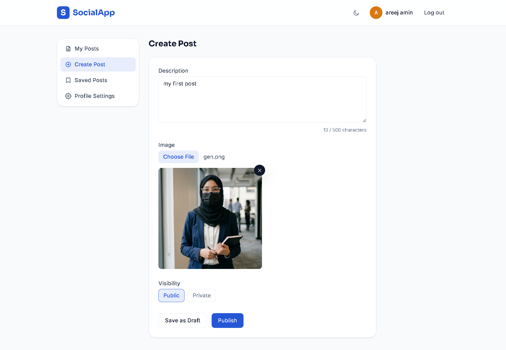
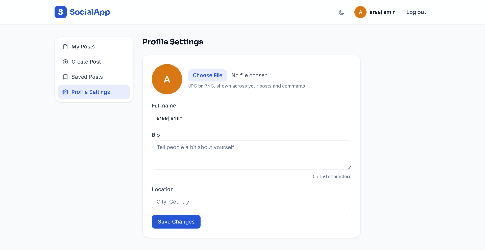
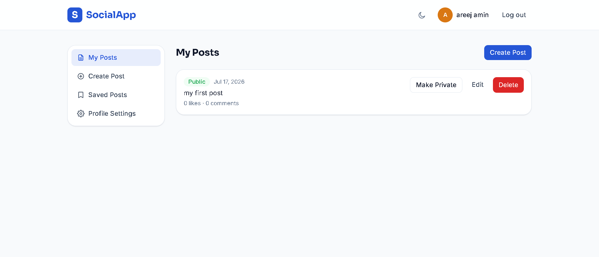

# SocialApp

A Facebook-inspired social feed, built frontend-only in React — sign up, post, like, comment, and manage your profile, with every byte of data living in `localStorage`.

## Live demo

> Add your deployed link here after publishing to Vercel or Netlify, e.g. `https://social-app-your-name.vercel.app`

## Screenshots


>
> ```md
> 
> 
> 
> 
> ```

## Tech stack

- **React (Vite)** — frontend framework and build tool
- **React Router v6** — multi-page navigation, dynamic routes, protected routes
- **Tailwind CSS** — utility-first styling, dark mode via the `dark:` variant
- **React Hook Form** — login, signup, post creation/editing, profile settings
- **Context API** — global auth state (`AuthContext`)
- **localStorage** — the only data store: users, posts, comments, likes
- **clsx** — conditional className composition
- **React.lazy + Suspense** — every page is code-split and loads on demand

## Features

- Sign up with validated name/email/password (+ confirm password), log in, log out — session survives a page refresh
- Public feed of published posts, sorted newest first, with an empty state
- Guests can see Like/Comment buttons on the feed but are redirected to `/login` with a contextual message when they try to use them
- Create posts with a description, an optional image upload (with live preview), and Public/Private visibility
- Save posts as a draft or publish immediately
- Manage your own posts: edit, delete (with a custom confirmation modal), toggle public/private, publish a draft
- Post detail page with like/unlike, and a comment thread visible to everyone
- Add and delete your own comments, with an inline "Are you sure? Yes / No" confirmation
- Public profile pages with cover image, avatar, bio, location, join date, and that user's public posts
- Profile settings to update name, bio (with a live character counter), location, and avatar — changes reflect instantly in the navbar
- Protected dashboard (`/dashboard/*`) that redirects unauthenticated visitors to `/login`
- **Bonus:** live search on the feed, filtering by description as you type
- **Bonus:** bookmark/save posts, with a dedicated "Saved Posts" dashboard section
- **Bonus:** dark mode toggle, persisted to `localStorage`
- **Bonus:** live character counter on the post description (turns orange at 400, red at 480, disables submit at 500)
- **Bonus:** image preview with a clear/remove button on both Create Post and Edit Post
- **Bonus:** delete-your-own-comment with an inline confirmation, not `window.confirm()`

## How to run locally

```bash
git clone https://github.com/areejaminmaker/social-app-areej_amin.git
cd social-app-areej_amin
npm install
npm run dev
```

The app opens at `http://localhost:5173`. No backend, no environment variables, no API keys needed — everything runs in the browser.

To create a production build:

```bash
npm run build
npm run preview
```

## Folder structure

```
social-app/
├── src/
│   ├── components/
│   │   ├── layout/
│   │   │   ├── Navbar.jsx
│   │   │   └── Footer.jsx
│   │   ├── post/
│   │   │   ├── PostCard.jsx
│   │   │   ├── PostForm.jsx
│   │   │   ├── PostActions.jsx
│   │   │   └── CommentSection.jsx
│   │   ├── profile/
│   │   │   └── ProfileHeader.jsx
│   │   ├── ui/
│   │   │   ├── Button.jsx
│   │   │   ├── Input.jsx
│   │   │   ├── Modal.jsx
│   │   │   ├── Avatar.jsx
│   │   │   └── Badge.jsx
│   │   └── RequireAuth.jsx
│   ├── context/
│   │   └── AuthContext.jsx
│   ├── hooks/
│   │   ├── useLocalStorage.js
│   │   ├── usePosts.js
│   │   ├── useAuth.js
│   │   ├── useBookmarks.js
│   │   └── useTheme.js
│   ├── pages/
│   │   ├── FeedPage.jsx
│   │   ├── LoginPage.jsx
│   │   ├── SignupPage.jsx
│   │   ├── PostDetailPage.jsx
│   │   ├── ProfilePage.jsx
│   │   ├── NotFoundPage.jsx
│   │   └── dashboard/
│   │       ├── DashboardLayout.jsx
│   │       ├── PostsDashboard.jsx
│   │       ├── CreatePost.jsx
│   │       ├── EditPost.jsx
│   │       ├── SavedPosts.jsx
│   │       └── ProfileSettings.jsx
│   ├── utils/
│   │   ├── storage.js
│   │   └── helpers.js
│   ├── App.jsx
│   └── main.jsx
```

## localStorage data structure

All data lives under five keys.

**`users`**
```json
[
  {
    "id": "usr_1703001234_abc",
    "name": "Asad Khan",
    "email": "asad@test.com",
    "password": "Password123",
    "bio": "React developer from Lahore",
    "location": "Lahore, Pakistan",
    "avatar": "data:image/jpeg;base64,...",
    "coverImage": null,
    "joinedAt": "2025-01-15T10:00:00Z",
    "bookmarks": ["post_1703001234_xyz"]
  }
]
```

**`posts`**
```json
[
  {
    "id": "post_1703001234_xyz",
    "authorId": "usr_1703001234_abc",
    "description": "Hello everyone! This is my first post.",
    "image": "data:image/jpeg;base64,...",
    "isPublic": true,
    "isDraft": false,
    "createdAt": "2025-01-15T10:00:00Z",
    "updatedAt": "2025-01-15T10:00:00Z"
  }
]
```

**`comments`**
```json
[
  { "id": "cmt_1703001234", "postId": "post_1703001234_xyz", "authorId": "usr_1703001234_abc", "text": "Great post!", "createdAt": "2025-01-15T10:05:00Z" }
]
```

**`likes`**
```json
[
  { "id": "like_1703001234", "postId": "post_1703001234_xyz", "userId": "usr_1703001234_abc", "createdAt": "2025-01-15T10:03:00Z" }
]
```

**`currentUser`** — the logged-in user (password stripped), or absent if logged out.
**`theme`** — `"light"` or `"dark"`.

## What I learned

Building SocialApp without a backend forced me to think carefully about where "the source of truth" actually lives — everything routes through a single `storage.js` module so every component reads and writes data the same way, which made it much easier to keep the users, posts, comments, and likes arrays consistent with each other. Wiring up `AuthContext` clarified how React's Context API avoids prop drilling: once `currentUser` lives at the top of the tree, any page or component can ask "who's logged in?" without threading props down five levels. React Hook Form's `watch()` made cross-field validation (confirm password, live character counters) straightforward once I understood it re-renders on every keystroke of the watched field. Building `RequireAuth` as a small wrapper component taught me the pattern for protected routes in React Router v6 — checking auth state and redirecting via `<Navigate>` rather than reaching for imperative navigation. Finally, `React.lazy` + `Suspense` showed me how code-splitting works at the page level almost for free, and reinforced why extracting reusable UI (`Button`, `Input`, `Avatar`, `Badge`, `Modal`) early saves a lot of duplicate styling later.

## Known limitations

- All data is scoped to a single browser — there's no real backend, so nothing syncs across devices and clearing browser storage wipes the account.
- Passwords are stored in plain text in `localStorage`, which is fine for a learning project but would never fly with a real backend (hashing, salting, and server-side auth would be required).
- Images are stored as base64 strings, which bloats `localStorage` quickly — a real backend would upload to object storage (S3, Cloudinary) and store a URL instead.
- No pagination — the feed loads every public post at once, which wouldn't scale past a few hundred posts.
- No real-time updates between browser tabs/users — a backend with WebSockets or polling would be needed for that.
- With a real backend I'd add: server-side validation, rate limiting, image compression, notifications, and a proper follow/friend graph instead of a flat public feed.
video link:
PART 1:https://www.loom.com/share/1e168a495c554870a7aec6d49297213c
PART 2:https://www.loom.com/share/b79a5673ad9845c299afacd80391cc31